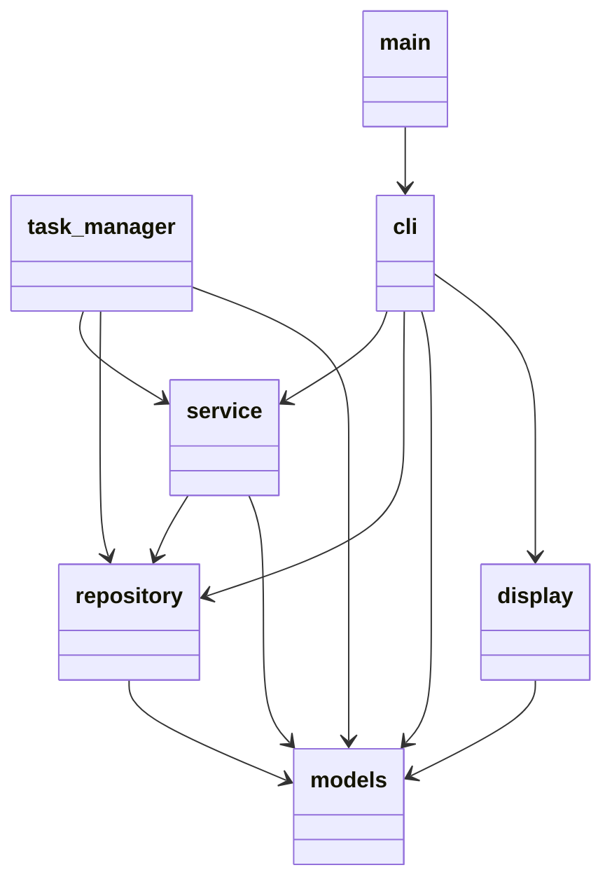

# Task Manager

A CLI task management application with SQLite persistence.

## Features

- Create, read, update, delete tasks
- Toggle task completion status
- Search by priority, category, or date range
- Sort by due date, priority, or creation time
- Persistent SQLite storage

## Installation

```bash
pip install -r requirements.txt
```

## Usage

```bash
# Create a task
python -m task_manager create "Review PR" --priority HIGH --due "2026-01-10 14:00" --category Work

# List all tasks
python -m task_manager list

# Update a task
python -m task_manager update 1

# Delete a task
python -m task_manager delete 1

# Toggle completion
python -m task_manager toggle 1

# Search tasks
python -m task_manager search --priority HIGH
python -m task_manager search --category Work
python -m task_manager search --from "2026-01-01 00:00" --to "2026-01-31 23:59"

# Sort tasks
python -m task_manager list --sort-by priority
python -m task_manager list --sort-by due_date
```

## UML Diagrams

>Generated by PyReverse with support through PyLint.

### Class Diagram

```mermaid
classDiagram
  class CLI {
    run(args: argparse.Namespace) int
  }
  class Priority {
    name
    from_string(value: str) Priority
  }
  class Task {
    category : str
    created_at : Optional[datetime]
    description : str
    due_date : Optional[datetime]
    id : Optional[int]
    is_completed : bool
    priority
    title : str
    toggle_completed() Task
    with_updates(title: Optional[str], description: Optional[str], is_completed: Optional[bool], priority: Optional[Priority], due_date: Optional[datetime], category: Optional[str]) Task
  }
  class TaskNotFoundError {
  }
  class TaskRepository {
    create(task: Task) Task
    delete(task_id: int) bool
    find_by_category(category: str) Sequence[Task]
    find_by_date_range(field: str, start: datetime, end: datetime) Sequence[Task]
    find_by_priority(priority: Priority) Sequence[Task]
    get_all() Sequence[Task]
    get_by_id(task_id: int) Optional[Task]
    get_sorted(sort_by: str) Sequence[Task]
    update(task: Task) bool
  }
  class TaskService {
    create_task(title: str, description: str, priority: Priority, due_date: Optional[datetime], category: str) Task
    delete_task(task_id: int) None
    get_task(task_id: int) Task
    list_tasks(sort_by: Optional[str]) Sequence[Task]
    search_by_category(category: str) Sequence[Task]
    search_by_date_range(field: str, start: datetime, end: datetime) Sequence[Task]
    search_by_priority(priority: Priority) Sequence[Task]
    toggle_completed(task_id: int) Task
    update_task(task_id: int, title: Optional[str], description: Optional[str], priority: Optional[Priority], due_date: Optional[datetime], category: Optional[str]) Task
  }
  Task --> Priority : priority
```




### Packages Diagram




## Project Structure

```
1.1 - Task Manager/
├── data/
│   ├── tasks.db
├── task_manager/
│   ├── __init__.py
│   ├── __main__.py      # CLI entry point
│   ├── cli.py           # Argument parsing
│   ├── models.py        # Task dataclass
│   ├── repository.py    # Database operations
│   ├── service.py       # Business logic
│   └── display.py       # Output formatting
├── tests/
│   ├── __init__.py
│   ├── Figuring out
│   ├── Figuring out
│   └── Figuring out
├── requirements.txt
└── README.md
```

## Design Principles

- **Single Responsibility**: Each module has one clear purpose
- **Dependency Injection**: Repository injected into service for testability
- **Type Safety**: Full type hints throughout
- **Immutable Data**: Task model uses frozen dataclass
- **Clean Interfaces**: Clear boundaries between layers
